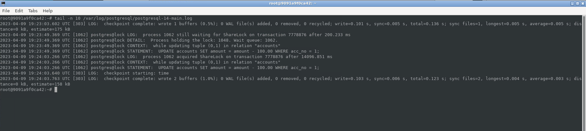
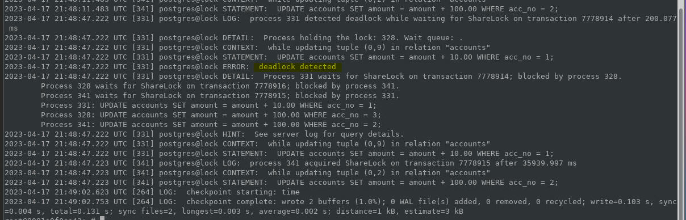

sudo pg_ctlcluster 14 main start 
psql -U  postgres -h localhost -p 5432 
1. Настройка сервера так, чтобы в журнал сообщений сбрасывалась информация о блокировках, удерживаемых более 200 миллисекунд 
postgres=# show log_lock_waits; 
log_lock_waits 
---------------- 
on 
(1 row) 
 
postgres=# 
SHOW deadlock_timeout; 
Result :1 sec 
 
ALTER SYSTEM SET deadlock_timeout = '0.2s'; 
SELECT pg_reload_conf(); 
postgres=# SHOW deadlock_timeout; 
deadlock_timeout 
------------------ 
200ms 
(1 row) 
 
postgres=# 
 

2. Обновления одной и той же строки тремя командами UPDATE в разных сеансах 
--session 1 
lock=# BEGIN; 
BEGIN 
lock=*# UPDATE accounts SET amount = amount - 100.00 WHERE acc_no = 1; 
 
--session 2 
UPDATE accounts SET amount = amount - 100.00 WHERE acc_no = 1; 
 
# Открываем новое окно терминала 
tail -n 10 /var/log/postgresql/postgresql-14-main.log 
 
2)Обновления одной и той же строки тремя командами UPDATE в разных сеансах 
 
--Сессия 1 
lock=# BEGIN; 
BEGIN 
lock=*# SELECT txid_current(), pg_backend_pid(); 
 txid_current | pg_backend_pid 
--------------+---------------- 
7778906       |328 
(1 row) 
 
lock=*# UPDATE accounts SET amount = amount + 100.00 WHERE acc_no = 1; 
UPDATE 1 
lock=*# SELECT * FROM locks_v WHERE pid = 328; 
 pid |   locktype    |  lockid  |mode| granted 
-----+---------------+----------+------------------+--------- 
 328 | relation      | accounts | RowExclusiveLock | t 
 328 | transactionid | 7778906  | ExclusiveLock    | t 
(2 rows) 
 
lock=*# 
 
--Сессия 2 
lock=# BEGIN; 
BEGIN 
lock=*# SELECT txid_current(), pg_backend_pid(); 
 txid_current | pg_backend_pid 
--------------+---------------- 
7778907       |341 
(1 row) 
 
--Сессия 3  
lock=# BEGIN; 
BEGIN 
lock=*# SELECT txid_current(), pg_backend_pid(); 
 txid_current | pg_backend_pid 
--------------+---------------- 
7778908       |331 
(1 row) 
 
lock=*# 
 
Запустили апдейт в сессии 2 и смотрим , что произошло для этого процесса 
 
lock=*# SELECT * FROM locks_v WHERE pid = 341; 
 pid |   locktype    |   lockid   |mode| granted 
-----+---------------+------------+------------------+--------- 
 341 | relation      | accounts   | RowExclusiveLock | t 
 341 | transactionid | 7778907    | ExclusiveLock    | t 
 341 | tuple         | accounts:9 | ExclusiveLock    | t 
 341 | transactionid | 7778906    | ShareLock        | f 
 (4 rows) 
  
Запустили апдейт в сессии 3 и смотрим , что произошло для этого процесса 
 
lock=*# SELECT * FROM locks_v WHERE pid = 331; 
pid |   locktype    |   lockid   |mode| granted 
-----+---------------+------------+------------------+--------- 
331 | relation      | accounts   | RowExclusiveLock | t 
331 | transactionid | 7778908    | ExclusiveLock    | t 
331 | tuple         | accounts:9 | ExclusiveLock    | f 
(3 rows) 
 
lock=*# 
 
lock=*# SELECT pid, wait_event_type, wait_event, pg_blocking_pids(pid) FROM pg_stat_activity  WHERE backend_type = 'client backend' ORDER BY pid; 
pid | wait_event_type |  wait_event   | pg_blocking_pids 
-----+-----------------+---------------+------------------ 
328 |     |               |  {} 
331 | Lock| tuple         | {341} 
341 | Lock| transactionid | {328} 
(3 rows) 
 
lock=*# 
 
Итог: 
после апдейта в первой сессии   (pid 328)- наложили блокировку 
во второй сессии (pid = 341)  - появилась блокировка shareLock c параметром false, и появилась запись tuple ( строка заблокирована) 
сессия 3 (pid = 331) - ссылается на tuple, доступ закрыт, не может сделать ExclusiveLock. 
 
Информация о блокирующих процессах: 
есть транзакция без блокировки 
341 блокируется 328 процессом 
Дальше идет tuple, который блокируется 341-ым 
 
 
3)Взаимоблокировка трех транзакций 
 step 1  сессия 1  UPDATE accounts SET amount = amount - 100.00 WHERE acc_no = 1; 
 step 2  сессия 2  UPDATE accounts SET amount = amount - 10.00 WHERE acc_no = 2; 
 step 3  сессия 3  UPDATE accounts SET amount = amount - 30.00 WHERE acc_no = 3; 
 step 4  сессия 1  UPDATE accounts SET amount = amount + 100.00 WHERE acc_no = 3; 
 step 5  сессия 3  UPDATE accounts SET amount = amount + 100.00 WHERE acc_no = 2; 
 step 6  сессия 2  UPDATE accounts SET amount = amount + 10.00 WHERE acc_no = 1; 
   
-- Сессия  #1 
lock=# BEGIN; 
BEGIN 
lock=*# SELECT txid_current(), pg_backend_pid(); 
txid_current | pg_backend_pid 
--------------+---------------- 
7778914      |328 
(1 row) 
 
lock=*# UPDATE accounts SET amount = amount - 100.00 WHERE acc_no = 1; 
UPDATE 1 
lock=*# UPDATE accounts SET amount = amount + 100.00 WHERE acc_no = 3; 
 
 
-- Сессия  #2 
lock=# BEGIN; 
BEGIN 
lock=*# SELECT txid_current(), pg_backend_pid(); 
txid_current | pg_backend_pid 
--------------+---------------- 
7778915 |331 
(1 row) 
 
lock=*# UPDATE accounts SET amount = amount - 10.00 WHERE acc_no = 2; 
UPDATE 1 
lock=*# UPDATE accounts SET amount = amount + 10.00 WHERE acc_no = 1; 
ERROR:  deadlock detected 
DETAIL:  Process 331 waits for ShareLock on transaction 7778914; blocked by process 328. 
Process 328 waits for ShareLock on transaction 7778916; blocked by process 341. 
Process 341 waits for ShareLock on transaction 7778915; blocked by process 331. 
HINT:  See server log for query details. 
CONTEXT:  while updating tuple (0,9) in relation "accounts" 
lock=!# 
 
-- Сессия #3 
BEGIN 
lock=*# SELECT txid_current(), pg_backend_pid(); 
txid_current | pg_backend_pid 
--------------+---------------- 
7778916 |341 
(1 row) 
 
lock=*# UPDATE accounts SET amount = amount - 30.00 WHERE acc_no = 3; 
UPDATE 1 
lock=*# UPDATE accounts SET amount = amount + 100.00 WHERE acc_no = 2; 
UPDATE 1 
lock=*# 
 

4) Могут ли две транзакции, выполняющие единственную команду UPDATE одной и той же таблицы (без where), заблокировать друг друга? 
Теоритически могут, но получить не удалось 
SELECT FOR UPDATE временно блокирует другие транзакции 
Блокировка, получаемая транзакцией Repeatable Read, гарантирует, что никакая другая транзакция, изменяющая таблицу, не выполняется 
Был сделан тест: 
Создаем таблицу 
CREATE TABLE t(id INT GENERATED ALWAYS AS IDENTITY, n float); 
INSERT INTO t(n) select random() from generate_series( 1,1000000); 
 
--Сессия 1 
BEGIN TRANSACTION ISOLATION LEVEL REPEATABLE READ; 
UPDATE t set n = ( select id from t order by ID  LIMIT 1 for update); 
 
--Сессия 2 
BEGIN TRANSACTION ISOLATION LEVEL REPEATABLE READ; 
UPDATE t set n = ( select id from t order by ID  LIMIT 1 for update); 
 
В первой сессии апдейт прошел , во второй - ждал блокировку 
как только сделала commit в Сессии 1, во второй появилось сообщение: 
ERROR:  could not serialize access due to concurrent update 
 