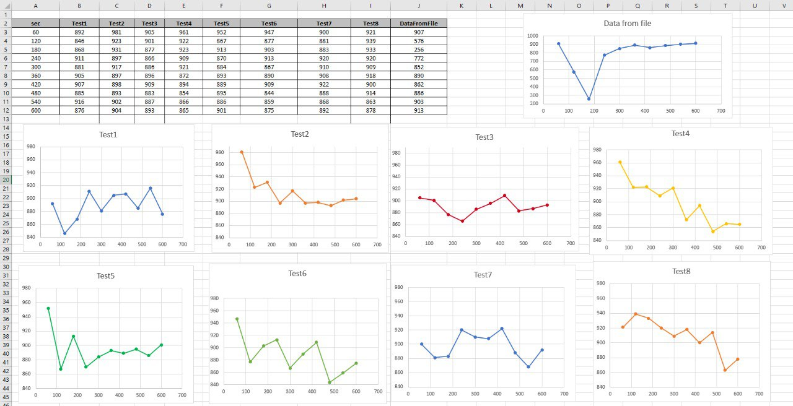

Default data for claster:
 
max_connections = 100
 
shared_buffers = 128MB
 
effective_cache_size = 4GB
 
maintenance_work_mem = 64MB
 
checkpoint_completion_target = 0.9
 
wal_buffers = 4MB
 
default_statistics_target = 100
 
random_page_cost = 4
   
effective_io_concurrency = 1
 
work_mem = 4MB
 
min_wal_size = 80MB
 
max_wal_size = 1GB
 

 
1. Set new data:
 
  max_connections = 40
 
  shared_buffers = 1GB
 
  effective_cache_size = 3GB
 
  maintenance_work_mem = 512MB
 
  checkpoint_completion_target = 0.9
 
  wal_buffers = 16MB
 
  default_statistics_target = 500
 
  random_page_cost = 4
 
  effective_io_concurrency = 2
 
  work_mem = 6553kB
 
  min_wal_size = 4GB
 
  max_wal_size = 16G
 
 
ALTER SYSTEM SET shared_buffers = '1GB';
 
ALTER SYSTEM SET effective_cache_size = '3GB';
 
ALTER SYSTEM SET maintenance_work_mem = '512MB';
 
ALTER SYSTEM SET wal_buffers = '16MB';
 
ALTER SYSTEM SET default_statistics_target = 500;
 
ALTER SYSTEM SET effective_io_concurrency = 2;
 
ALTER SYSTEM SET work_mem = '6553kB';
 
ALTER SYSTEM SET min_wal_size = '4GB';
 
ALTER SYSTEM SET max_wal_size = '16GB';
 
 
2. --restart cluster for applying new settings:
 
sudo pg_ctlcluster 14 main restart
 
psql -U  postgres -h localhost -p 5432
 

 
3. Run pgbench in other window
 
pgbench -i postgres
 
pgbench -c8 -P 60 -T 600 -U postgres postgres
 
pgbench (14.7 (Ubuntu 14.7-1.pgdg20.04+1))
 
starting vacuum...end.
 
progress: 60.0 s, 907.4 tps, lat 8.802 ms stddev 6.737
 
progress: 120.0 s, 576.5 tps, lat 13.865 ms stddev 23.444
 
progress: 180.0 s, 256.3 tps, lat 31.202 ms stddev 50.713
 
progress: 240.0 s, 772.3 tps, lat 10.348 ms stddev 8.548
 
progress: 300.0 s, 852.4 tps, lat 9.374 ms stddev 7.335
 
progress: 360.0 s, 890.6 tps, lat 8.971 ms stddev 7.316
 
progress: 420.0 s, 862.3 tps, lat 9.266 ms stddev 7.045
 
progress: 480.0 s, 886.4 tps, lat 9.013 ms stddev 6.803
 
progress: 540.0 s, 903.8 tps, lat 8.840 ms stddev 6.720
 
progress: 600.0 s, 913.0 tps, lat 8.750 ms stddev 6.591
 
transaction type: <builtin: TPC-B (sort of)>
 
 
scaling factor: 1
 
query mode: simple
 
number of clients: 8
 
number of threads: 1
 
duration: 600 s
 
number of transactions actually processed: 469268
 
latency average = 10.217 ms
 
latency stddev = 13.670 ms
 
initial connection time = 12.154 ms
 
tps = 782.118039 (without initial connection time)
 
postgres@9091a9f0ca42:~$
 

 
4. Test 1
 
ALTER SYSTEM SET log_autovacuum_min_duration = 0;
 
ALTER SYSTEM SET autovacuum_max_workers = 10;
 
ALTER SYSTEM SET autovacuum_naptime = '15s';
 
ALTER SYSTEM SET autovacuum_vacuum_threshold = 25;
 
ALTER SYSTEM SET autovacuum_vacuum_scale_factor = 0.05;
 
ALTER SYSTEM SET autovacuum_vacuum_cost_delay = 10;
 
ALTER SYSTEM SET autovacuum_vacuum_cost_limit = 1000;
 

 
ostgres@9091a9f0ca42:~$ pgbench -c8 -P 60 -T 600 -U postgres postgres
 
pgbench (14.7 (Ubuntu 14.7-1.pgdg20.04+1))
 
starting vacuum...end.
 
progress: 60.0 s, 892.4 tps, lat 8.951 ms stddev 6.955
 
progress: 120.0 s, 846.2 tps, lat 9.442 ms stddev 7.276
 
progress: 180.0 s, 868.1 tps, lat 9.205 ms stddev 7.117
 
progress: 240.0 s, 911.4 tps, lat 8.767 ms stddev 6.656
 
progress: 300.0 s, 881.2 tps, lat 9.066 ms stddev 6.873
 
progress: 360.0 s, 905.8 tps, lat 8.820 ms stddev 6.824
 
progress: 420.0 s, 907.7 tps, lat 8.802 ms stddev 6.700
 
progress: 480.0 s, 885.0 tps, lat 9.028 ms stddev 7.098
 
progress: 540.0 s, 916.4 tps, lat 8.718 ms stddev 6.564
 
progress: 600.0 s, 876.6 tps, lat 9.115 ms stddev 7.574
 
transaction type: <builtin: TPC-B (sort of)>
 
scaling factor: 1
 
query mode: simple
 
number of clients: 8
 
number of threads: 1
 
duration: 600 s
 
number of transactions actually processed: 533458
 
latency average = 8.986 ms
 
latency stddev = 6.968 ms
 
initial connection time = 14.666 ms
 
tps = 889.101037 (without initial connection time)
 
postgres@9091a9f0ca42:~$
 

 
--
 
5. Test 2
 
ALTER SYSTEM SET log_autovacuum_min_duration = 0;
 
ALTER SYSTEM SET autovacuum_max_workers = 5;
 
ALTER SYSTEM SET autovacuum_naptime = '30s';
 
ALTER SYSTEM SET autovacuum_vacuum_threshold = 100;
 
ALTER SYSTEM SET autovacuum_vacuum_scale_factor = 0.1;
 
ALTER SYSTEM SET autovacuum_vacuum_cost_delay = 10;
 
ALTER SYSTEM SET autovacuum_vacuum_cost_limit = 1000;
 

 
ostgres@9091a9f0ca42:~$ pgbench -c8 -P 60 -T 600 -U postgres postgres
 
pgbench (14.7 (Ubuntu 14.7-1.pgdg20.04+1))
 
starting vacuum...end.
 
progress: 60.0 s, 981.4 tps, lat 8.138 ms stddev 5.635
 
progress: 120.0 s, 923.4 tps, lat 8.651 ms stddev 6.342
 
progress: 180.0 s, 931.8 tps, lat 8.573 ms stddev 6.536
 
progress: 240.0 s, 897.9 tps, lat 8.897 ms stddev 6.991
 
progress: 300.0 s, 917.1 tps, lat 8.711 ms stddev 6.479
 
progress: 360.0 s, 897.1 tps, lat 8.906 ms stddev 6.802
 
progress: 420.0 s, 898.3 tps, lat 8.894 ms stddev 6.697
 
progress: 480.0 s, 893.1 tps, lat 8.946 ms stddev 6.786
 
progress: 540.0 s, 902.8 tps, lat 8.849 ms stddev 6.634
 
progress: 600.0 s, 904.7 tps, lat 8.831 ms stddev 6.559
 
transaction type: <builtin: TPC-B (sort of)>
 
scaling factor: 1
 
query mode: simple
 
number of clients: 8
 
number of threads: 1
 
duration: 600 s
 
number of transactions actually processed: 548874
 
latency average = 8.733 ms
 
latency stddev = 6.551 ms
 
initial connection time = 12.641 ms
 
tps = 914.794861 (without initial connection time)
 
postgres@9091a9f0ca42:~$
 

 
6. Test 3
 
ALTER SYSTEM SET autovacuum_max_workers = 5;
 
ALTER SYSTEM SET autovacuum_naptime = '15s';
 
ALTER SYSTEM SET autovacuum_vacuum_threshold = 50;
 
ALTER SYSTEM SET autovacuum_vacuum_scale_factor = 0.01;
 
ALTER SYSTEM SET autovacuum_vacuum_cost_delay = 10;
 
ALTER SYSTEM SET autovacuum_vacuum_cost_limit = 1500;
 

 
postgres@9091a9f0ca42:~$ pgbench -c8 -P 60 -T 600 -U postgres postgres
 
pgbench (14.7 (Ubuntu 14.7-1.pgdg20.04+1))
 
starting vacuum...end.
 
progress: 60.0 s, 905.3 tps, lat 8.823 ms stddev 6.858
 
progress: 120.0 s, 901.5 tps, lat 8.863 ms stddev 6.411
 
progress: 180.0 s, 877.0 tps, lat 9.110 ms stddev 6.818
 
progress: 240.0 s, 866.4 tps, lat 9.223 ms stddev 6.995
 
progress: 300.0 s, 886.3 tps, lat 9.015 ms stddev 7.314
 
progress: 360.0 s, 896.1 tps, lat 8.917 ms stddev 6.821
 
progress: 420.0 s, 909.3 tps, lat 8.786 ms stddev 6.562
 
progress: 480.0 s, 883.8 tps, lat 9.040 ms stddev 6.756
 
progress: 540.0 s, 887.2 tps, lat 9.005 ms stddev 6.774
 
progress: 600.0 s, 893.2 tps, lat 8.945 ms stddev 6.809
 
transaction type: <builtin: TPC-B (sort of)>
 
scaling factor: 1
 
query mode: simple
 
number of clients: 8
 

 
7. Test 4
 
ALTER SYSTEM SET autovacuum_max_workers = 5;
 
ALTER SYSTEM SET autovacuum_naptime = '15s';
 
ALTER SYSTEM SET autovacuum_vacuum_threshold = 50;
 
ALTER SYSTEM SET autovacuum_vacuum_scale_factor = 0.01;
 
ALTER SYSTEM SET autovacuum_vacuum_cost_delay = 20;
 
ALTER SYSTEM SET autovacuum_vacuum_cost_limit = 3000;
 
postgres@9091a9f0ca42:~$ pgbench -c8 -P 60 -T 600 -U postgres postgres
 
pgbench (14.7 (Ubuntu 14.7-1.pgdg20.04+1))
 
starting vacuum...end.
 
progress: 60.0 s, 961.4 tps, lat 8.307 ms stddev 5.930
 
progress: 120.0 s, 922.4 tps, lat 8.661 ms stddev 6.227
 
progress: 180.0 s, 923.8 tps, lat 8.648 ms stddev 6.247
 
progress: 240.0 s, 909.4 tps, lat 8.786 ms stddev 6.606
 
progress: 300.0 s, 921.7 tps, lat 8.668 ms stddev 6.505
 
progress: 360.0 s, 872.7 tps, lat 9.155 ms stddev 6.957
 
progress: 420.0 s, 894.6 tps, lat 8.932 ms stddev 6.785
 
progress: 480.0 s, 854.5 tps, lat 9.351 ms stddev 7.740
 
progress: 540.0 s, 866.5 tps, lat 9.221 ms stddev 7.055
 
progress: 600.0 s, 865.2 tps, lat 9.236 ms stddev 7.097
 
transaction type: <builtin: TPC-B (sort of)>
 
scaling factor: 1
 
query mode: simple
 
number of clients: 8
 
number of threads: 1
 
duration: 600 s
 
number of transactions actually processed: 539544
 
latency average = 8.885 ms
 
latency stddev = 6.724 ms
 
initial connection time = 12.023 ms
 
tps = 899.247149 (without initial connection time)
 
postgres@9091a9f0ca42:~$
 

 
8. Test 5
 
ALTER SYSTEM SET autovacuum_max_workers = 5;
 
ALTER SYSTEM SET autovacuum_naptime = '30s';
 
ALTER SYSTEM SET autovacuum_vacuum_threshold = 100;
 
ALTER SYSTEM SET autovacuum_vacuum_scale_factor = 0.1;
 
ALTER SYSTEM SET autovacuum_vacuum_cost_delay = 10;
 
ALTER SYSTEM SET autovacuum_vacuum_cost_limit = 1500;
 

 
ostgres@9091a9f0ca42:~$ pgbench -c8 -P 60 -T 600 -U postgres postgres
 
pgbench (14.7 (Ubuntu 14.7-1.pgdg20.04+1))
 
starting vacuum...end.
 
progress: 60.0 s, 952.3 tps, lat 8.386 ms stddev 6.151
 
progress: 120.0 s, 867.1 tps, lat 9.216 ms stddev 6.865
 
progress: 180.0 s, 913.5 tps, lat 8.746 ms stddev 6.337
 
progress: 240.0 s, 870.1 tps, lat 9.183 ms stddev 7.664
 
progress: 300.0 s, 884.7 tps, lat 9.031 ms stddev 6.791
 
progress: 360.0 s, 893.6 tps, lat 8.939 ms stddev 6.716
 
progress: 420.0 s, 889.1 tps, lat 8.988 ms stddev 6.786
 
progress: 480.0 s, 895.3 tps, lat 8.924 ms stddev 6.667
 
progress: 540.0 s, 886.3 tps, lat 9.015 ms stddev 7.122
 
progress: 600.0 s, 901.9 tps, lat 8.858 ms stddev 6.669
 
transaction type: <builtin: TPC-B (sort of)>
 
scaling factor: 1
 
query mode: simple
 
number of clients: 8
 
number of threads: 1
 
duration: 600 s
 
number of transactions actually processed: 537244
 
latency average = 8.923 ms
 
latency stddev = 6.784 ms
 
number of transactions actually processed: 537244
 
latency average = 8.923 ms
 
latency stddev = 6.784 ms
 
initial connection time = 12.614 ms
 
tps = 895.413875 (without initial connection time)
 
postgres@9091a9f0ca42:~$
 

 
9. Test 6
 

 
ALTER SYSTEM SET log_autovacuum_min_duration = 0;
 
ALTER SYSTEM SET autovacuum_max_workers = 5;
 
ALTER SYSTEM SET autovacuum_naptime = '30s';
 
ALTER SYSTEM SET autovacuum_vacuum_threshold = 50;
 
ALTER SYSTEM SET autovacuum_vacuum_scale_factor = 0.05;
 
ALTER SYSTEM SET autovacuum_vacuum_cost_delay = 20;
 
ALTER SYSTEM SET autovacuum_vacuum_cost_limit = 3000;
 

 
postgres@9091a9f0ca42:~$ pgbench -c8 -P 60 -T 600 -U postgres postgres
 
pgbench (14.7 (Ubuntu 14.7-1.pgdg20.04+1))
 
starting vacuum...end.
 
progress: 60.0 s, 947.2 tps, lat 8.432 ms stddev 6.343
 
progress: 120.0 s, 877.4 tps, lat 9.106 ms stddev 6.644
 
progress: 180.0 s, 903.8 tps, lat 8.839 ms stddev 6.391
 
progress: 240.0 s, 913.5 tps, lat 8.746 ms stddev 6.546
 
progress: 300.0 s, 867.8 tps, lat 9.207 ms stddev 7.000
 
progress: 360.0 s, 890.7 tps, lat 8.971 ms stddev 6.811
 
progress: 420.0 s, 909.0 tps, lat 8.789 ms stddev 6.661
 
progress: 480.0 s, 844.7 tps, lat 9.459 ms stddev 8.038
 
progress: 540.0 s, 859.2 tps, lat 9.300 ms stddev 7.384
 
progress: 600.0 s, 875.3 tps, lat 9.128 ms stddev 6.874
 
transaction type: <builtin: TPC-B (sort of)>
 
scaling factor: 1
 
query mode: simple
 
number of clients: 8
 
number of threads: 1
 
duration: 600 s
 
number of transactions actually processed: 533332
 
latency average = 8.988 ms
 
latency stddev = 6.879 ms
 
initial connection time = 12.794 ms
 
tps = 888.894345 (without initial connection time)
 
postgres@9091a9f0ca42:~$
 

 
10. Test 7
 
ALTER SYSTEM SET autovacuum_max_workers = 5;
 
ALTER SYSTEM SET autovacuum_naptime = '30s';
 
ALTER SYSTEM SET autovacuum_vacuum_threshold = 50;
 
ALTER SYSTEM SET autovacuum_vacuum_scale_factor = 0.01;
 
ALTER SYSTEM SET autovacuum_vacuum_cost_delay = 10;
 
ALTER SYSTEM SET autovacuum_vacuum_cost_limit = 1500;
 

 
postgres@9091a9f0ca42:~$ pgbench -c8 -P 60 -T 600 -U postgres postgres
 
pgbench (14.7 (Ubuntu 14.7-1.pgdg20.04+1))
 
starting vacuum...end.
 
progress: 60.0 s, 900.1 tps, lat 8.874 ms stddev 6.679
 
progress: 120.0 s, 881.2 tps, lat 9.067 ms stddev 6.697
 
progress: 180.0 s, 883.7 tps, lat 9.041 ms stddev 6.737
 
progress: 240.0 s, 920.0 tps, lat 8.684 ms stddev 6.457
 
progress: 300.0 s, 910.6 tps, lat 8.774 ms stddev 6.630
 
progress: 360.0 s, 908.4 tps, lat 8.795 ms stddev 6.456
 
progress: 420.0 s, 922.2 tps, lat 8.664 ms stddev 6.533
 
progress: 480.0 s, 888.6 tps, lat 8.992 ms stddev 6.832
 
progress: 540.0 s, 868.5 tps, lat 9.200 ms stddev 7.076
 
progress: 600.0 s, 892.4 tps, lat 8.953 ms stddev 6.690
 
progress: 420.0 s, 922.2 tps, lat 8.664 ms stddev 6.533
 
progress: 480.0 s, 888.6 tps, lat 8.992 ms stddev 6.832
 
progress: 540.0 s, 868.5 tps, lat 9.200 ms stddev 7.076
 
progress: 600.0 s, 892.4 tps, lat 8.953 ms stddev 6.690
 
transaction type: <builtin: TPC-B (sort of)>
 
scaling factor: 1
 
query mode: simple
 
number of clients: 8
 
number of threads: 1
 
duration: 600 s
 
number of transactions actually processed: 538554
 
latency average = 8.901 ms
 
latency stddev = 6.680 ms
 
initial connection time = 12.847 ms
 
tps = 897.598063 (without initial connection time)
 
postgres@9091a9f0ca42:~$
 

 
11. Test 8
 
ALTER SYSTEM SET autovacuum_naptime = '15s';
 
ALTER SYSTEM SET autovacuum_vacuum_threshold = 100;
 
ALTER SYSTEM SET autovacuum_vacuum_scale_factor = 0.01;
 
ALTER SYSTEM SET autovacuum_vacuum_cost_delay = 10;
 
ALTER SYSTEM SET autovacuum_vacuum_cost_limit = 1000;
 
 
postgres@9091a9f0ca42:~$ pgbench -c8 -P 60 -T 600 -U postgres postgres
 
pgbench (14.7 (Ubuntu 14.7-1.pgdg20.04+1))
 
starting vacuum...end.
 
progress: 60.0 s, 921.3 tps, lat 8.670 ms stddev 6.445
 
progress: 120.0 s, 939.2 tps, lat 8.506 ms stddev 6.040
 
progress: 180.0 s, 933.3 tps, lat 8.559 ms stddev 6.113
 
progress: 240.0 s, 920.0 tps, lat 8.684 ms stddev 6.569
 
progress: 300.0 s, 909.3 tps, lat 8.787 ms stddev 6.596
 
progress: 360.0 s, 918.4 tps, lat 8.699 ms stddev 6.536
 
progress: 420.0 s, 900.8 tps, lat 8.870 ms stddev 6.735
 
progress: 480.0 s, 914.3 tps, lat 8.738 ms stddev 7.085
 
progress: 540.0 s, 863.2 tps, lat 9.257 ms stddev 7.089
 
progress: 600.0 s, 878.0 tps, lat 9.100 ms stddev 6.908
 
transaction type: <builtin: TPC-B (sort of)>
 
scaling factor: 1
 
query mode: simple
 
number of clients: 8
 
number of threads: 1
 
duration: 600 s
 
number of transactions actually processed: 545882
 
latency average = 8.781 ms
 
latency stddev = 6.617 ms
 
initial connection time = 12.080 ms
 
tps = 909.805831 (without initial connection time)
 
postgres@9091a9f0ca42:~$
